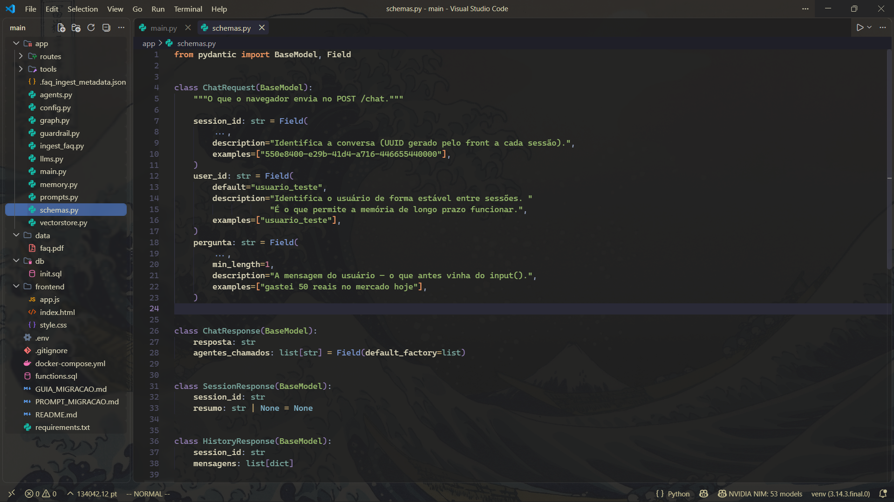

# vladfiles

Dotfiles pessoais para montar um ambiente de desenvolvimento limpo, discreto e funcional. O primeiro pacote é o VS Code com Kanagawa, glassmorphism leve, wallpaper inspirado em `The Great Wave` e atalhos focados em teclado.



## VS Code

O pacote em [`vscode/`](vscode/) contém configurações, atalhos, extensões, CSS, assets e instaladores para Windows 11+ e Linux. Os instaladores fazem backup dos arquivos locais, mesclam as configurações e substituem os atalhos após o backup.

### Instalação

Windows PowerShell:

```powershell
Set-ExecutionPolicy -Scope Process Bypass
.\vscode\install.ps1
```

Linux:

```bash
chmod +x vscode/install.sh
./vscode/install.sh
```

Depois, no VS Code, execute `Custom CSS and JS: Enable` e reinicie a janela para ativar o CSS. Essa etapa é necessária porque a extensão usa um mecanismo de personalização não oficial do VS Code.

### Atalhos principais

| Atalho | Ação |
| --- | --- |
| `Ctrl+Shift+E` | Alterna entre o File Tree e o editor ativo |
| `Ctrl+Alt+K` | Abre a cheat sheet de atalhos do VS Code |

O arquivo [`vscode/config/keybindings.json`](vscode/config/keybindings.json) contém a lista completa.

## Git

O pacote em [`git/`](git/) contém uma configuração global conservadora para Git, focada em comportamento previsível no Linux/WSL. Ela usa `main` por padrão, limpa referências remotas antigas, configura upstream no primeiro push e impede que `git pull` crie merges ou rebases automaticamente.

Veja [`git/README.md`](git/README.md) para instalação e detalhes.

## Estrutura

```text
vladfiles/
├── git/
│   ├── .gitconfig    # configuração global conservadora do Git
│   └── README.md     # instalação e decisões da configuração
└── vscode/
    ├── assets/       # wallpaper e preview
    ├── config/       # settings, keybindings e extensões
    ├── css/          # camadas visuais do glassmorphism
    ├── install.ps1   # Windows 11+
    └── install.sh    # Linux
```

Mais ambientes serão adicionados aqui conforme o repositório crescer.

## Licença

Distribuído sob a [Beerware License](LICENSE). Se este repositório for útil e a gente se encontrar, uma Coca-Cola é uma forma válida de agradecimento.
